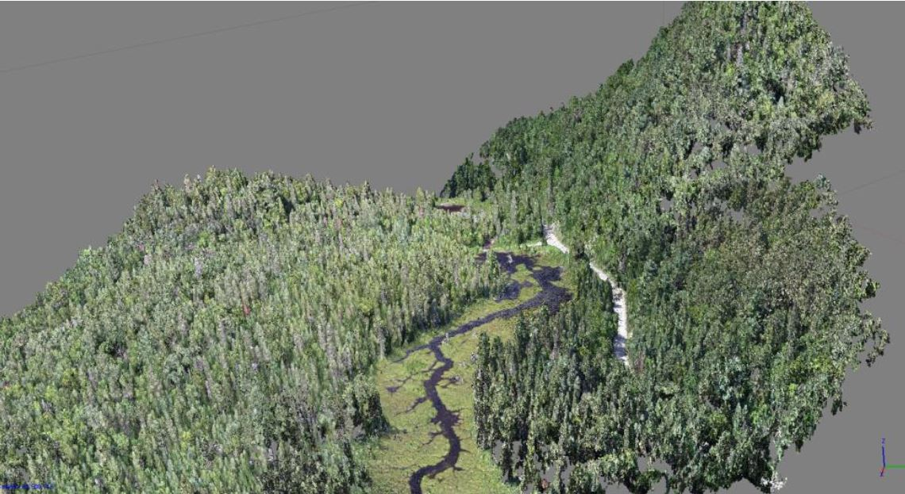

# Deep learning research project funded by the Canadian Wood Fibre Centre

The main goal of the project was to explore applications of deep learning techniques for the recognition of tree species with high resolution imagery acquired with a drone. As an effort of contribution to the domain, we have decided upfront to make the drone-acquired data as well as the produced orthomosaics available and thus have created this data repository.

## Drone mission
The drone mission took place on Thursday, August 16, 2018, in the regional park of Forêt-Ouareau near the suspension bridge area. Details regarding acquisition and orthomosaic creation are available in the project [final report](CCFB02_Final_Report.pdf)

Both multispectral and visible orthomosaics can be downloaded following this [link](https://drive.google.com/drive/folders/1WxW4UG29zKYBbJ_ist9nXvfcZ8b_vnqt)

### Multispectral
Archive is about 60 Go and contains the following files:

* foret_ouareau_multispectral.psx : Agisoft project file
* foret_ouareau_multispectral.files : Agisoft default generated files folder (Zipped in 5 archives of ~12Go to ease download)
* foret_ouareau_CIR.tif : Georeferenced orthomosaic : red, green, near-infrared 
* foret_ouareau_multispectral.tif : Georeferenced orthomosaic multispectral (5 bands)
* foret_ouareau_multispectral_MNS.tif : Georeferenced Digital Surface Model
* foret_ouareau_NDVI.tif : Georeferenced NDVI (Normalized difference vegetation index) orthomosaic
* foret_ouareau_NDVI_coloré.tif : Georeferenced NDVI orthomosaic orthomosaïque using colors gradient
* foret_ouareau_points_multispectral.las : Georeferenced 3D points cloud
* rapport qualité visible.pdf : Processing report generated by Agisoft

### Visible 
Archive is about 47 Go and contains the following files:

* foret_ouareau_visible.psx : Agisoft project file
* foret_ouareau_visible.files : Agisoft default generated files folder (Zipped in 4 archives of ~12Go to ease download)
* foret_ouareau_points_visible.las : Georeferenced 3D RGB points cloud
* foret_ouareau_visible.tif : Georeferenced visible orthomosaic
* foret_ouareau_visible_MNS_tif : Georeferenced Digital Surface Model
* rapport qualité visible.pdf : Processing report generated by Agisoft

